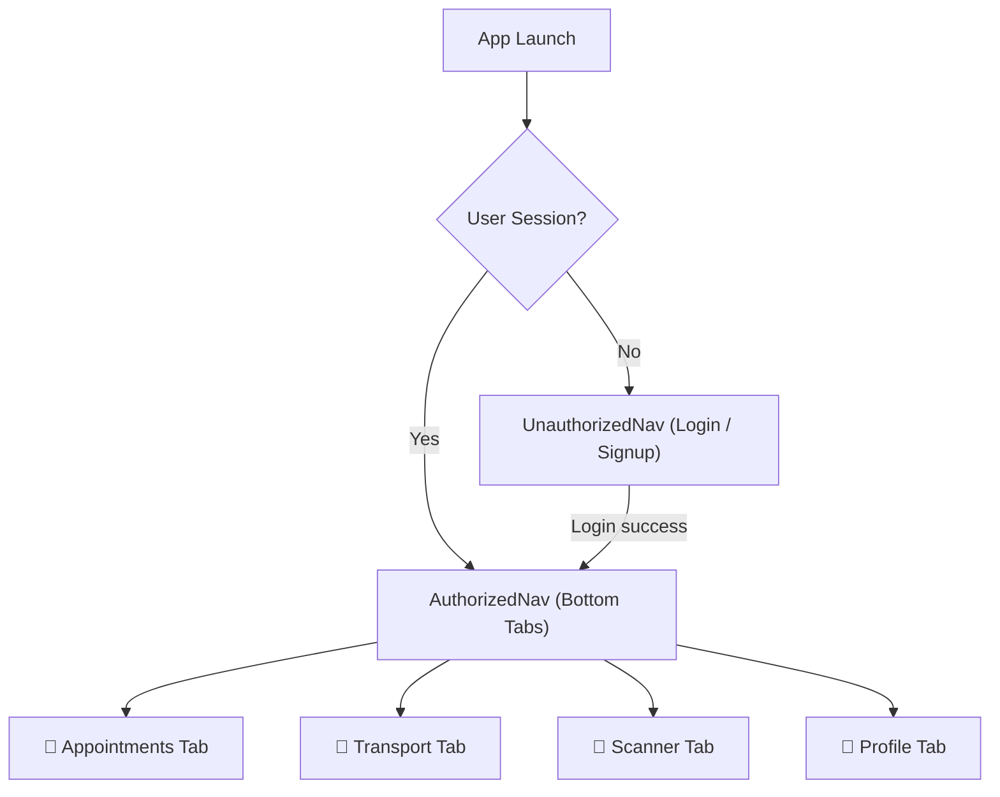
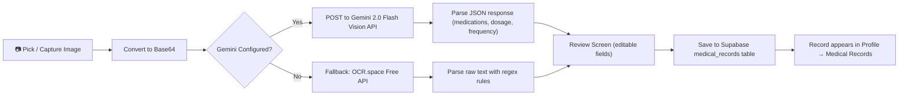
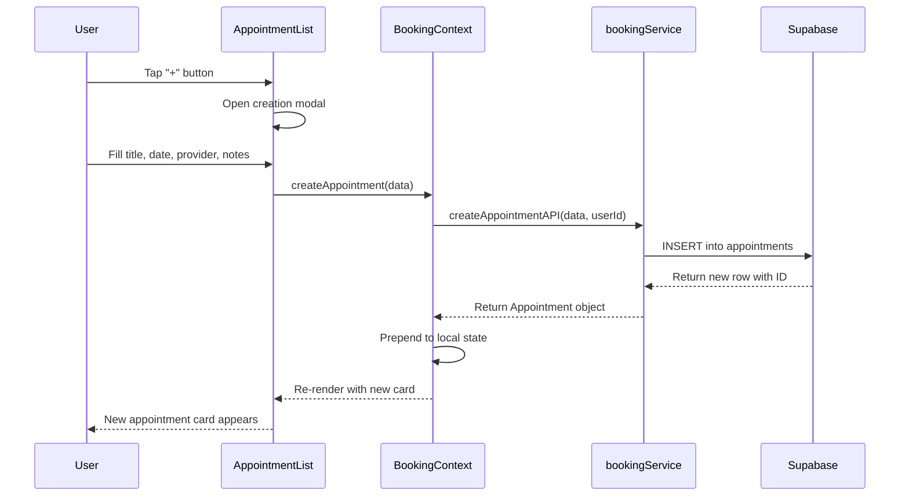

# 🏥 CareSync — AI-Powered Healthcare Companion

<div align="center">


**Your all-in-one mobile health platform — appointments, transport, and AI prescription scanning, unified.**

[](https://reactnative.dev)
[](https://expo.dev)
[](https://typescriptlang.org)
[](https://supabase.com)
[](https://ai.google.dev)
[](https://expo.dev)

[🔧 Setup Guide](#-setup-instructions) • [✨ Features](#-features) • [🏗️ Architecture](#️-architecture--data-flow) • [📁 Project Structure](#-project-structure) • [📱 How to Use](#-how-to-use)

</div>

---

## 📋 Table of Contents

- [🎯 Overview](#-overview)
- [✨ Features](#-features)
- [🏗️ Architecture & Data Flow](#️-architecture--data-flow)
- [📁 Project Structure](#-project-structure)
- [🚀 Setup Instructions](#-setup-instructions)
- [📱 How to Use](#-how-to-use)
- [🗄️ Database Schema](#️-database-schema)
- [🧪 Testing](#-testing)
- [🛠️ Troubleshooting](#️-troubleshooting)
- [🤝 Contributing](#-contributing)
- [📄 License](#-license)

---

## 🎯 Overview

**CareSync** is a modern, AI-powered healthcare companion app built with React Native and Expo. It brings together everything a patient (or carer) needs in one beautifully designed mobile experience — book medical appointments, schedule medical transport, and digitize paper prescriptions using Google Gemini AI vision.

### 🌟 What Makes CareSync Special?

- **🤖 AI Prescription Scanner** — Point your camera at any prescription and Gemini 2.0 Flash reads it instantly, extracting medications, dosages, and frequencies into a clean digital record.
- **📅 Appointment Management** — Create, track, and manage medical appointments with real-time status updates (Upcoming / Completed / Cancelled).
- **🚗 Medical Transport Booking** — Book Standard, Wheelchair, or Ambulance rides to your appointments directly from the app.
- **☁️ Cloud-Synced Records** — Everything is securely stored in Supabase (PostgreSQL) and synced across devices.
- **🎨 Premium UI** — Glassmorphism cards, linear gradients, Manrope typography, and smooth micro-animations give it a hospital-grade, polished feel.
- **📱 Cross-Platform** — Runs on iOS, Android, and Web from a single codebase.

---

## ✨ Features

### 🚀 Core Features

| Feature | Description | Status |
|---------|-------------|--------|
| **🔐 Auth (Sign Up / Login)** | Email + password auth via Supabase, with persistent sessions | ✅ **Live** |
| **📅 Appointment Booking** | Create, view, update status, and delete appointments | ✅ **Live** |
| **🚗 Transport Scheduling** | Book Standard / Wheelchair / Ambulance rides | ✅ **Live** |
| **🤖 AI Prescription OCR** | Scan prescriptions with Gemini 2.0 Flash + OCR.space fallback | ✅ **Live** |
| **💊 Digital Medical Records** | Save & review digitized prescriptions per-user in the cloud | ✅ **Live** |
| **👤 User Profile** | View account info, role (Patient/Carer), and usage stats | ✅ **Live** |
| **🌐 Web Support** | Responsive web view with a centered phone-sized container | ✅ **Live** |

### 🔐 Authentication & Security

- **Supabase Auth**: Industry-standard JWT-based email/password authentication
- **Persistent Sessions**: Users stay logged in across app restarts via AsyncStorage
- **Profile Row Sync**: User profile is created atomically on signup — no orphaned auth records
- **Role-Based Accounts**: Users register as either `Patient` or `Carer`
- **Network Timeout Guards**: Every Supabase call is wrapped with a 15-second timeout to prevent silent hangs

### 📱 User Experience

- **Manrope Font Family**: Clean, modern typography loaded via `@expo-google-fonts`
- **Material Design 3**: Powered by `react-native-paper` with a fully customized CareSync palette
- **Linear Gradients**: Hero sections and cards use `expo-linear-gradient`
- **Glassmorphism**: Frosted-glass card overlays with subtle transparency
- **Animated Transitions**: Scroll-linked animations on the Profile hero section
- **Date Picker**: Native `@react-native-community/datetimepicker` for appointment scheduling

---

## 🏗️ Architecture & Data Flow

### Provider Nesting (Top-Down)

CareSync follows a **Context + Service Layer** architecture. All global state is managed through React Context, and all database calls are isolated in dedicated service files.

```
SafeAreaProvider
  └── AuthProvider          ← Authentication state (user, login, signup, logout)
        └── BookingProvider ← Appointment CRUD state
              └── TransportProvider ← Ride booking state
                    └── MedicalProvider ← OCR scan & medical records state
                          └── PaperProvider (Material Design theme)
                                └── RootNavigator
                                      ├── UnauthorizedNav (Login / Signup)
                                      └── AuthorizedNav (Bottom Tabs)
```

### Navigation Flow



### Data Flow: AI Prescription Scan



### Component Interaction: Appointment Creation



---

## 📁 Project Structure

```
CareSyncApp/
└── CareSync/                              # React Native / Expo app root
    ├── 📄 App.js                          # App entry — provider wiring & theme
    ├── 📄 app.json                        # Expo config (permissions, icons, EAS)
    ├── 📄 package.json                    # Dependencies & npm scripts
    ├── 📄 tsconfig.json                   # TypeScript configuration
    ├── 📄 jest.config.js                  # Jest test configuration
    │
    ├── 🖼️ assets/                         # App icons, splash screen, favicon
    │
    └── 📂 src/
        ├── 📂 config/
        │   ├── ai.ts                      # Gemini API key & model config
        │   └── supabase.ts                # Supabase client initialization
        │
        ├── 📂 constants/
        │   └── theme.tsx                  # Design tokens (colors, fonts, spacing, shadows)
        │
        ├── 📂 context/
        │   ├── AuthContext.tsx            # User auth state (login/signup/logout)
        │   ├── BookingContext.tsx         # Appointment CRUD state
        │   ├── MedicalContext.tsx         # OCR scan & medical records state
        │   └── TransportContext.tsx       # Ride booking state
        │
        ├── 📂 navigation/
        │   ├── AuthorizedNav.tsx          # Bottom tab navigator (post-login)
        │   └── UnauthorizedNav.tsx        # Stack navigator (login/signup)
        │
        ├── 📂 screens/
        │   ├── 📂 Auth/
        │   │   ├── LoginScreen.tsx        # Email/password login UI
        │   │   └── SignupScreen.tsx       # Registration with role selection
        │   ├── 📂 Booking/
        │   │   ├── AppointmentList.tsx    # Appointment cards, creation modal, status updates
        │   │   └── ScheduleRide.tsx       # Transport booking form & ride history
        │   ├── 📂 Medical/
        │   │   └── OCRscanner.tsx         # AI prescription scanner & records gallery
        │   └── 📂 Profile/
        │       ├── ProfileScreen.tsx      # User profile, stats, quick actions
        │       └── ProfileSetting.tsx     # Profile settings/edit screen
        │
        ├── 📂 services/
        │   ├── api.tsx                    # Shared Axios instance (base URL config)
        │   ├── authService.tsx            # Supabase auth & profile DB calls
        │   ├── bookingService.tsx         # Appointment CRUD (Supabase)
        │   ├── medicalService.tsx         # Medical records CRUD (Supabase)
        │   ├── ocrService.tsx             # Gemini Vision + OCR.space integration
        │   └── transportService.tsx       # Transport booking CRUD (Supabase)
        │
        ├── 📂 components/
        │   ├── CustomButton.tsx           # Branded gradient button component
        │   └── CustomInput.tsx            # Styled text input with validation state
        │
        └── 📂 utils/
            ├── transformDate.tsx          # Date formatting helpers (ISO → display)
            ├── validations.tsx            # Form validation functions
            └── validations.test.tsx       # Unit tests for validators
```

---

## 🚀 Setup Instructions

### ⚡ Prerequisites

Before you begin, make sure you have the following installed:

| Tool | Version | Download |
|------|---------|----------|
| **Node.js** | v18 or later | [nodejs.org](https://nodejs.org) |
| **npm** | v9 or later | Comes with Node.js |
| **Expo CLI** | Latest | `npm install -g expo-cli` |
| **Git** | Any | [git-scm.com](https://git-scm.com) |
| **Expo Go App** | Latest | [iOS](https://apps.apple.com/app/expo-go/id982107779) / [Android](https://play.google.com/store/apps/details?id=host.exp.exponent) |

> **Optional**: Android Studio (for Android emulator) or Xcode (for iOS simulator on macOS).

---

### 🔥 Quick Start (under 5 minutes)

```bash
# 1. Clone the repository
git clone https://github.com/yourusername/CareSyncApp.git
cd CareSyncApp/CareSync

# 2. Install dependencies
npm install

# 3. Start the development server
npm start
```

Then scan the QR code with **Expo Go** on your phone. That's it! 🎉

---

### 🔧 Full Setup (with your own Backend)

If you want your own Supabase database and Gemini API key (recommended for development), follow these steps.

---

#### Step 1 — Clone & Install

```bash
git clone https://github.com/yourusername/CareSyncApp.git
cd CareSyncApp/CareSync
npm install
```

---

#### Step 2 — Set Up Supabase (Free)

Supabase is the backend that stores all user data, appointments, medical records, and transport bookings.

1. **Create a free account** at [supabase.com](https://supabase.com)

2. **Create a new project** — give it any name (e.g., `caresync-dev`)

3. **Get your credentials** — In your project dashboard, go to:
   `Settings → API`
   Copy your **Project URL** and **anon/public API key**.

4. **Open** `src/config/supabase.ts` and replace the values:

   ```typescript
   const supabaseUrl = 'YOUR_PROJECT_URL';       // e.g. https://xxxx.supabase.co
   const supabaseAnonKey = 'YOUR_ANON_KEY';       // starts with eyJ...
   ```

5. **Create the database tables** — Go to `SQL Editor` in your Supabase dashboard and run the following SQL scripts one by one:

**Users table:**
```sql
create table public.users (
  id uuid references auth.users on delete cascade primary key,
  name text not null,
  email text not null,
  role text not null default 'Patient'
);
alter table public.users disable row level security;
```

**Appointments table:**
```sql
create table public.appointments (
  id uuid default gen_random_uuid() primary key,
  user_id uuid references auth.users on delete cascade not null,
  title text not null,
  date text not null,
  status text not null default 'Upcoming',
  provider text,
  location text,
  notes text
);
alter table public.appointments disable row level security;
```

**Medical Records table:**
```sql
create table public.medical_records (
  id uuid default gen_random_uuid() primary key,
  user_id uuid references auth.users on delete cascade not null,
  image_uri text,
  medications jsonb not null default '[]',
  patient_name text,
  prescribed_by text,
  prescribed_date text,
  confidence numeric,
  saved_at timestamptz default now()
);
alter table public.medical_records disable row level security;
```

**Transport Bookings table:**
```sql
create table public.transport_bookings (
  id uuid default gen_random_uuid() primary key,
  user_id uuid references auth.users on delete cascade not null,
  ride_type text not null default 'Standard',
  pickup_address text not null,
  destination_address text not null,
  patient_name text,
  notes text,
  status text not null default 'Scheduled',
  scheduled_at timestamptz default now(),
  created_at timestamptz default now()
);
alter table public.transport_bookings disable row level security;
```

> **Note**: Row Level Security (RLS) is disabled for development. For production, enable RLS and add appropriate policies.

---

#### Step 3 — Get a Gemini API Key (Free)

The OCR scanner uses **Google Gemini 2.0 Flash** for AI-powered prescription reading.

1. Visit [Google AI Studio](https://aistudio.google.com/app/apikey)
2. Click **"Create API Key"** — it's free with generous limits
3. Copy your API key
4. Open `src/config/ai.ts` and replace the key:

   ```typescript
   export const GEMINI_API_KEY = 'YOUR_GEMINI_API_KEY_HERE';
   ```

> **Without a Gemini key**: The app automatically falls back to [OCR.space](https://ocr.space) free API, which handles basic text extraction.

---

#### Step 4 — Run the App

**On your phone (recommended):**
```bash
npm start
# Scan the QR code with Expo Go
```

**On Android Emulator:**
```bash
npm run android
```

**On iOS Simulator (macOS only):**
```bash
npm run ios
```

**In your Browser:**
```bash
npm run web
# Opens at http://localhost:8081
```

---

## 📱 How to Use

### 🔐 1. Create an Account

1. Open the app → tap **"Sign Up"**
2. Enter your **Name**, **Email**, and **Password**
3. Choose your role: **Patient** or **Carer**
4. Tap **"Create Account"** — you're logged in automatically

### 📅 2. Book an Appointment

1. Tap the **📅 Appointments** tab at the bottom
2. Tap the **"+" button** in the top-right corner
3. Fill in the title, date & time, provider, location, and notes
4. Tap **"Save"** — the appointment card appears instantly
5. Tap **"Manage"** on any card to change its status or delete it

### 🚗 3. Schedule a Ride

1. Tap the **🚗 Transport** tab
2. Choose a ride type: **Standard**, **Wheelchair**, or **Ambulance**
3. Enter the pickup and destination addresses
4. Tap **"Book Ride"** — your booking is confirmed immediately

### 🤖 4. Scan a Prescription

1. Tap the **🔬 Digitize** tab
2. Tap **"Pick from Gallery"** or **"Take Photo"**
3. Tap **"Scan with AI"** — Gemini reads the image and extracts:
   - Patient name & prescribing doctor
   - All medications with dosages and frequencies
4. Review the extracted data, then tap **"Save Record"**

### 👤 5. View Your Profile

1. Tap the **👤 Profile** tab
2. See your account info, role badge, and a summary of appointments and medical records saved

---

## 🗄️ Database Schema

```
┌──────────────────────┐
│        users         │
├──────────────────────┤
│ id       UUID (PK)   │ ← FK → auth.users
│ name     TEXT        │
│ email    TEXT        │
│ role     TEXT        │ Patient | Carer
└──────────────────────┘
           │
     ┌─────┴──────────┬──────────────────────┐
     ▼                ▼                      ▼
┌──────────────┐  ┌────────────────┐  ┌───────────────────┐
│ appointments │  │transport_book- │  │  medical_records  │
│              │  │     ings       │  │                   │
├──────────────┤  ├────────────────┤  ├───────────────────┤
│ id (UUID)    │  │ id (UUID)      │  │ id (UUID)         │
│ user_id      │  │ user_id        │  │ user_id           │
│ title        │  │ ride_type      │  │ medications JSONB │
│ date         │  │ pickup_address │  │ patient_name      │
│ status       │  │ dest_address   │  │ prescribed_by     │
│ provider     │  │ patient_name   │  │ prescribed_date   │
│ location     │  │ notes          │  │ confidence        │
│ notes        │  │ status         │  │ image_uri         │
└──────────────┘  │ scheduled_at   │  │ saved_at          │
                  └────────────────┘  └───────────────────┘
```

---

## 🧪 Testing

### Run Tests

```bash
# Run all tests once
npm test

# Run in watch mode (re-runs on file save)
npm run test:watch

# Run with coverage report
npm run test:coverage
```

### Manual Testing Checklist

- [ ] Sign up with a new email → user created in Supabase
- [ ] Log out and log back in → session restored automatically
- [ ] Create an appointment → appears in list, sorted by date
- [ ] Mark appointment as Completed / Cancelled
- [ ] Delete an appointment
- [ ] Book a transport ride → appears in history
- [ ] Cancel a transport ride
- [ ] Scan a prescription image
- [ ] Verify AI extracts medication names, dosages, and frequencies
- [ ] Save the scanned record → appears in the records gallery
- [ ] Delete a medical record

---

## 🛠️ Troubleshooting

### ❌ "Network request timed out" on Login / Signup

The app can't reach Supabase. Check your internet connection, verify the Supabase URL in `src/config/supabase.ts`, and try a different Wi-Fi network.

### ❌ Signup succeeds but login fails

Supabase email confirmation may be enabled. Go to:
`Supabase Dashboard → Authentication → Settings → Email Auth`
Disable **"Enable email confirmations"** for development.

### ❌ AI Scan returns "Unknown" for everything

1. Check that `GEMINI_API_KEY` in `src/config/ai.ts` is a valid key
2. Ensure the prescription image is well-lit, flat, and fully in frame
3. Check the console for `Gemini OCR failed` — the fallback to OCR.space will be used

### ❌ `npm install` fails with peer dependency errors

```bash
npm install --legacy-peer-deps
```

### ❌ Expo Go shows a blank screen or Metro is stuck

```bash
npx expo start --clear --reset-cache
```

### ❌ TypeScript errors in the editor

```bash
npx tsc --noEmit   # Check for type errors without building
```

---

## 🤝 Contributing

### How to Contribute

1. Fork the repository and clone it locally
2. Create a feature branch: `git checkout -b feature/your-feature-name`
3. Use design tokens from `src/constants/theme.tsx` — never raw color strings
4. Keep database calls in `src/services/` and global state in `src/context/`
5. Submit a pull request with a clear description and screenshots for UI changes

### Areas to Contribute

| Area | Task | Difficulty |
|------|------|------------|
| **🌙 Dark Mode** | Dark theme across all screens | 🟢 Beginner |
| **♿ Accessibility** | Screen reader labels for all elements | 🟢 Beginner |
| **🧪 Tests** | Expand unit test coverage for services | 🟢 Beginner |
| **📅 Appointments** | Recurring appointment support | 🟡 Intermediate |
| **🗺️ Transport** | Map view for ride pickup/destination | 🟡 Intermediate |
| **📊 Analytics** | Visit/health dashboard with charts | 🟡 Intermediate |
| **🔒 Auth** | Biometric (fingerprint/face) login | 🟡 Intermediate |
| **🤖 OCR** | Multi-page prescription scanning | 🔴 Advanced |

---

## 🗺️ Roadmap

### Version 1.1
- [ ] Push notifications for upcoming appointments
- [ ] Dark mode support
- [ ] Biometric authentication
- [ ] Export medical records as PDF

### Version 1.2
- [ ] Recurring appointments
- [ ] Real-time ride tracking on a map
- [ ] Multi-language support (i18n)
- [ ] Health metrics dashboard

### Version 2.0
- [ ] Caregiver ↔ Patient shared accounts
- [ ] Doctor / clinic directory integration
- [ ] Insurance card scanning (OCR)
- [ ] Telehealth video call integration

---

## 👨‍💻 Developer

<div align="center">

### **Built by [Neeraj Sahu]** 🚀

[](https://linkedin.com/in/neeraj-sahu-4a41a1248)
[](https://github.com/ZixxyFY)
[](mailto:sahuneeraj112005@gmail.com)

*"Building technology that makes healthcare more accessible, one feature at a time."*

</div>

---

## 📄 License

```
MIT License

Copyright (c) 2025 CareSync / Neeraj Sahu

Permission is hereby granted, free of charge, to any person obtaining a copy
of this software and associated documentation files (the "Software"), to deal
in the Software without restriction, including without limitation the rights
to use, copy, modify, merge, publish, distribute, sublicense, and/or sell
copies of the Software, and to permit persons to whom the Software is
furnished to do so, subject to the following conditions:

The above copyright notice and this permission notice shall be included in all
copies or substantial portions of the Software.

THE SOFTWARE IS PROVIDED "AS IS", WITHOUT WARRANTY OF ANY KIND, EXPRESS OR
IMPLIED, INCLUDING BUT NOT LIMITED TO THE WARRANTIES OF MERCHANTABILITY,
FITNESS FOR A PARTICULAR PURPOSE AND NONINFRINGEMENT. IN NO EVENT SHALL THE
AUTHORS OR COPYRIGHT HOLDERS BE LIABLE FOR ANY CLAIM, DAMAGES OR OTHER
LIABILITY, WHETHER IN AN ACTION OF CONTRACT, TORT OR OTHERWISE, ARISING FROM,
OUT OF OR IN CONNECTION WITH THE SOFTWARE OR THE USE OR OTHER DEALINGS IN THE
SOFTWARE.
```

---

<div align="center">

## ✨ Built with ❤️ using React Native, Expo, Supabase & Google Gemini AI ✨

**🌟 Star this repo if CareSync helped you! 🌟**

[](https://github.com/ZixxyFY/CareSyncApp)

</div>
